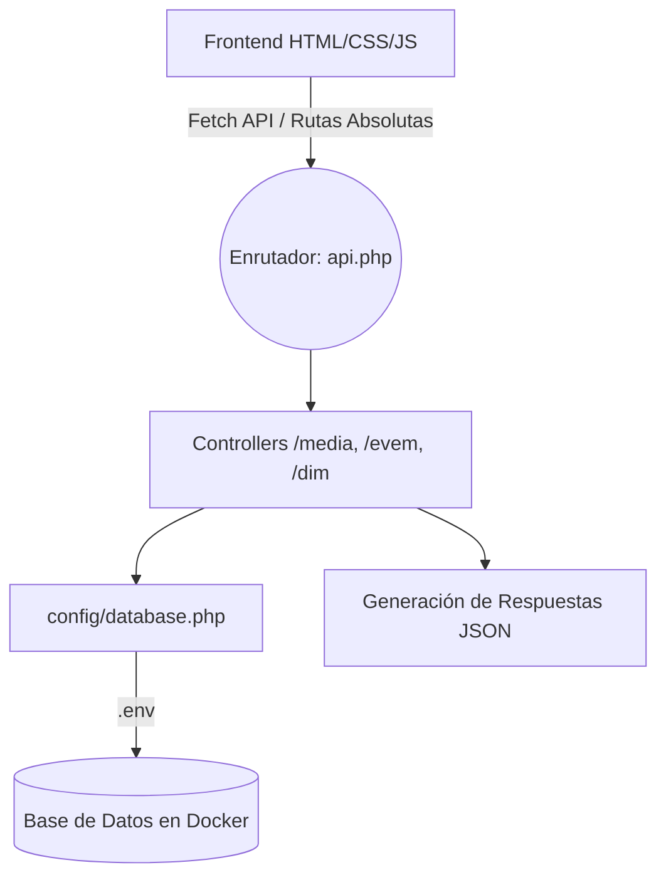
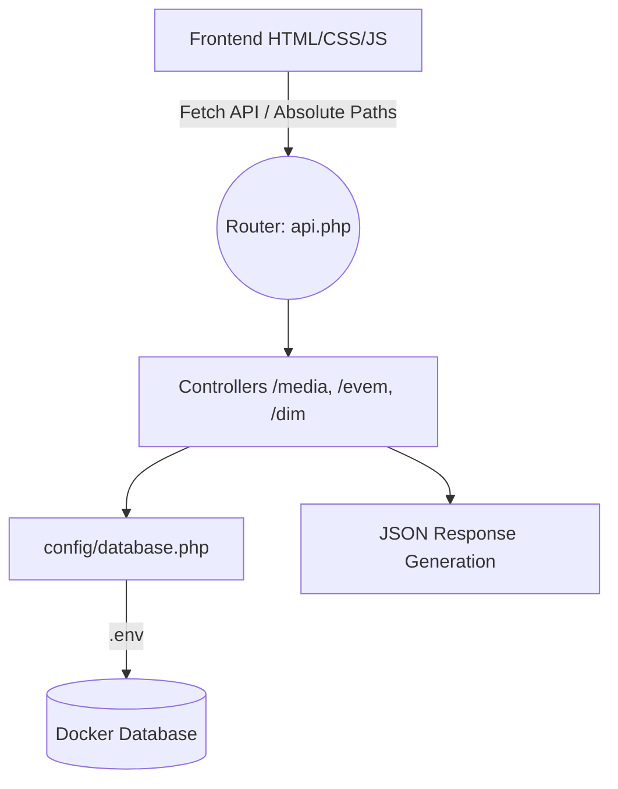

<div align="center">
  
  
  
  
  
  

  <h1>🎓 EVEM & DIM 2026</h1>
  <p><strong>Portal web y sistema de gestión integral para la XXVIII Escuela Venezolana para la Enseñanza de la Matemática y ecosistema científico</strong></p>

  <a href="https://evem.unet.edu.ve/" target="_blank" rel="noopener noreferrer">
    
  </a>
</div>

<br>

## 🌍 Tabla de contenido | Table of contents

- [Español](#es)
- [English](#en)

---

<a id="es"></a>

## 🇪🇸 Español

### 📝 Resumen del proyecto

**EVEM & DIM 2026** es un ecosistema web completo desarrollado para la **XXVIII Escuela Venezolana para la Enseñanza de la Matemática (EVEM)**, el **Día Internacional de las Matemáticas (DIM)**, el **Festival de Ciencias** y las **Olimpiadas de Astronomía (MAT)**. Organizado por la Universidad de Los Andes (ULA) y hospedado en la Universidad Nacional Experimental del Táchira (UNET). La plataforma modular integra sistemas de registro por dominio, catálogo de cursos dinámico, generación de certificados digitales y un backend basado en controladores para gestión en tiempo real.

> **Estado:** 🟢 Listo para producción
> **Arquitectura:** Frontend orientado a dominios + Backend (PHP Router/Controllers) + Docker
> **Edición:** 2026

### 📱 Demo visual

| Vista                    | Captura                                                                  |
| ------------------------ | ------------------------------------------------------------------------ |
| **Página de inicio**     |                |
| **Formulario EVEM**      |  |
| **Landing DIM**          |    |
| **Panel administrativo** |          |

> _Las capturas de pantalla se encuentran en la carpeta `docs/media/`._

### 🔐 Funcionalidades por evento / módulo

| Módulo             | Características                                                                                                    |
| ------------------ | ------------------------------------------------------------------------------------------------------------------ |
| **EVEM**           | Registro de asistentes y ponentes, selección de cursos, validación de disponibilidad y generación de certificados. |
| **DIM**            | Landing exclusiva, inscripción de equipos y participantes individuales, carga de comprobantes de pago.             |
| **Festival & MAT** | Páginas dedicadas a la divulgación científica, normativas de posters y registro de actividades alternas.           |
| **Administración** | Interfaz aislada para consultar inscritos, validar pagos y exportar listas.                                        |

### ⚙️ Logros técnicos

- **Entorno contenerizado (Docker):** despliegue estandarizado y reproducible con `docker-compose`, eliminando la dependencia de entornos locales como XAMPP.
- **Arquitectura Backend MVC (Front Controller):** un único punto de entrada (`api.php`) que enruta peticiones hacia controladores específicos aislados por dominio.
- **Seguridad mediante `.env`:** separación total de credenciales y lógica de conexión a la base de datos a través de variables de entorno.
- **Frontend modular:** organización de vistas en la carpeta `pages/` dividida semánticamente por eventos y uso estricto de rutas absolutas.
- **Generación de certificados 100% cliente:** uso de `html2canvas` y `jsPDF` para crear diplomas dinámicos en el navegador, aligerando la carga del servidor.

### 🏗️ Arquitectura del sistema



### 🛠️ Stack tecnológico

| Categoría       | Tecnología                                 |
| --------------- | ------------------------------------------ |
| Frontend        | HTML5, CSS3, JavaScript (ES6)              |
| Backend         | PHP nativo (arquitectura de controladores) |
| Base de datos   | MariaDB / MySQL                            |
| Infraestructura | Docker & Docker Compose                    |
| Librerías       | SweetAlert2, html2canvas, jsPDF            |

### 💻 Instalación local (Docker)

1. Clona el repositorio:

```bash
git clone https://github.com/JuanD-2005/evem-2025.git
cd evem-2025
```

2. Crea el archivo de variables de entorno `.env` en la raíz del proyecto y configura tus credenciales:

```env
DB_HOST=db
DB_NAME=evem_2025
DB_USER=admin
DB_PASS=secretpassword
```

3. Levanta los contenedores en segundo plano:

```bash
docker-compose up -d
```

4. Importa los datos:

- Conecta tu cliente SQL (por ejemplo, DBeaver) a `localhost:3306` con las credenciales del `.env`.
- Ejecuta tu archivo `.sql` de exportación para poblar la base de datos `evem_2025`.

5. Accede a la plataforma web:

Abre tu navegador en `http://localhost:8000/`.

---

<a id="en"></a>

## 🇺🇸 English

### 📝 Project summary

**EVEM & DIM 2026** is a comprehensive web ecosystem for the **XXVIII Venezuelan School for Mathematics Education (EVEM)**, the **International Day of Mathematics (DIM)**, the **Science Festival**, and the **Astronomy Olympiads (MAT)**. Hosted at the National Experimental University of Táchira (UNET). The modular platform integrates domain-based registration systems, dynamic course catalogs, digital certificate generation, and a controller-based backend for real-time management.

> **Status:** 🟢 Production ready
> **Architecture:** Domain-oriented frontend + Backend (PHP Router/Controllers) + Docker
> **Edition:** 2026

### 📱 Visual demo

| View            | Screenshot                                                             |
| --------------- | ---------------------------------------------------------------------- |
| **Homepage**    |                |
| **EVEM form**   |      |
| **DIM landing** |  |
| **Admin panel** |  |

> _Screenshots are located in the `docs/media/` folder._

### 🔐 Features by event / module

| Module             | Features                                                                                                        |
| ------------------ | --------------------------------------------------------------------------------------------------------------- |
| **EVEM**           | Registration for attendees and speakers, course selection, availability validation, and certificate generation. |
| **DIM**            | Exclusive landing page, team and individual registration, payment receipt upload.                               |
| **Festival & MAT** | Dedicated pages for science outreach, poster guidelines, and alternative activities registration.               |
| **Admin**          | Isolated interface to query enrollments, validate payments, and export lists.                                   |

### ⚙️ Technical achievements

- **Containerized Environment (Docker):** standardized and reproducible deployment with `docker-compose`, eliminating the need for local servers like XAMPP.
- **Backend MVC Architecture (Front Controller):** a single entry point (`api.php`) that routes requests to specific domain-isolated controllers.
- **Security via `.env`:** complete separation of database credentials and connection logic using environment variables.
- **Modular Frontend:** view organization in the `pages/` directory, semantically divided by events, using strict absolute paths.
- **100% client-side certificate generation:** `html2canvas` and `jsPDF` used to create dynamic diplomas in the browser, preventing server overload.

### 🏗️ System architecture



### 🛠️ Tech stack

| Category       | Technology                           |
| -------------- | ------------------------------------ |
| Frontend       | HTML5, CSS3, JavaScript (ES6)        |
| Backend        | Native PHP (controller architecture) |
| Database       | MariaDB / MySQL                      |
| Infrastructure | Docker & Docker Compose              |
| Libraries      | SweetAlert2, html2canvas, jsPDF      |

### 💻 Local setup (Docker)

1. Clone the repository:

```bash
git clone https://github.com/JuanD-2005/evem-2025.git
cd evem-2025
```

2. Create an `.env` file in the project root and set your credentials:

```env
DB_HOST=db
DB_NAME=evem_2025
DB_USER=admin
DB_PASS=secretpassword
```

3. Spin up the containers:

```bash
docker-compose up -d
```

4. Import data:

- Connect your SQL client (for example, DBeaver) to `localhost:3306` using the `.env` credentials.
- Run your SQL dump to populate the `evem_2025` database.

5. Access the web platform:

Open your browser at `http://localhost:8000/`.

---

## 🤝 Contribuciones | Contributing

1. Haz fork del repositorio / Fork this repository.
2. Crea una rama de trabajo / Create a feature branch (`git checkout -b feature/AmazingFeature`).
3. Haz commits descriptivos / Write clear commits (`git commit -m 'Add some AmazingFeature'`).
4. Abre un Pull Request / Open a Pull Request.

## 📄 Licencia | License

Distribuido bajo la licencia MIT. / Distributed under the MIT License.
