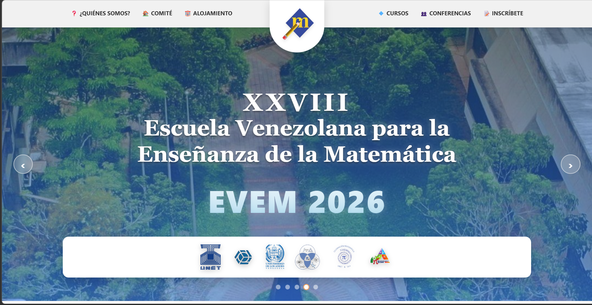
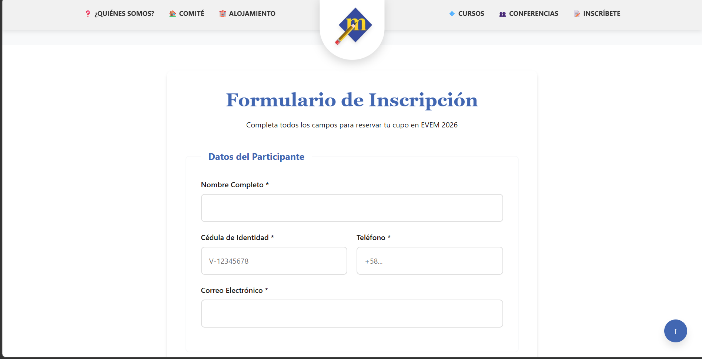
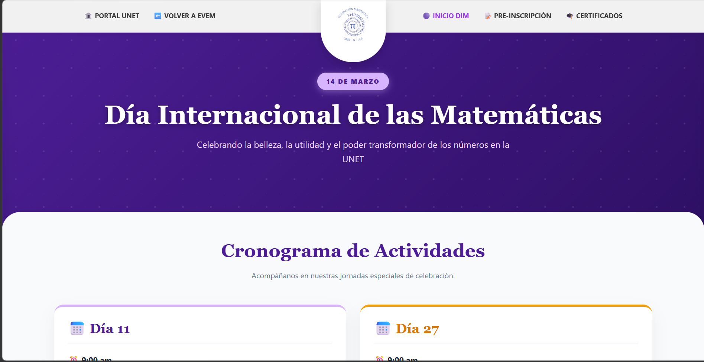
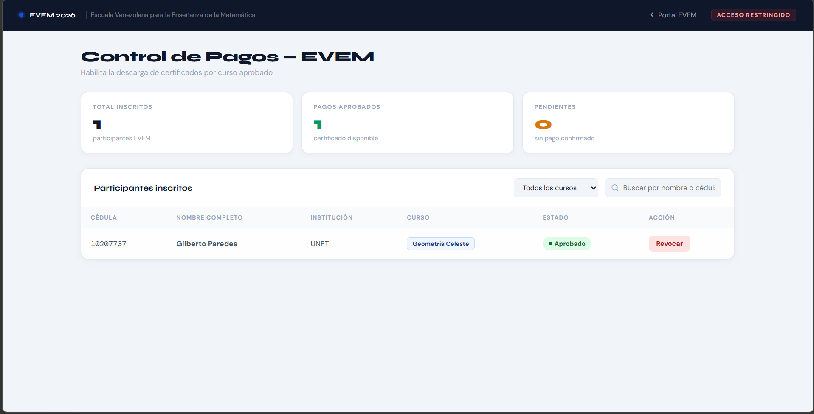

<div align="center">
  
  
  
  
  

  <h1>🎓 EVEM & DIM 2026</h1>
  <p><strong>Portal web y sistema de gestión integral para la XXVIII Escuela Venezolana para la Enseñanza de la Matemática y el Día Internacional de las Matemáticas</strong></p>

  <a href="https://tudominio.com" target="_blank" rel="noopener noreferrer">
    
  </a>
</div>

<br>

## 🌍 Tabla de contenido | Table of contents

- [Español](#es)
- [English](#en)

---

<a id="es"></a>
## 🇪🇸 Español

### 📝 Resumen del proyecto

**EVEM & DIM 2026** es un portal web completo desarrollado para la **XXVIII Escuela Venezolana para la Enseñanza de la Matemática (EVEM)** y el **Día Internacional de las Matemáticas (DIM)**, eventos organizados por la Universidad de Los Andes (ULA) y hospedados en la Universidad Nacional Experimental del Táchira (UNET). La plataforma integra un sistema de registro, catálogo de cursos, generación de certificados digitales y un panel administrativo para gestionar inscripciones y pagos en tiempo real.

> **Estado:** 🟢 Listo para producción  
> **Arquitectura:** Frontend (Vanilla JS) + Backend (PHP/MySQL)  
> **Edición:** 2026

### 📱 Demo visual

| Vista | Captura |
|---|---|
| **Página de inicio** |  |
| **Formulario EVEM** |  |
| **Landing DIM** |  |
| **Panel administrativo** |  |

> *Las capturas de pantalla se encuentran en la carpeta `docs/media/`.*

### 🔐 Funcionalidades por evento / módulo

| Módulo | Características |
|---|---|
| **EVEM** | Registro de asistentes y ponentes con selección de cursos, descuento automático de cupos, validación de disponibilidad. |
| **DIM** | Landing exclusiva, formulario de inscripción dividido (split-layout), generación de certificados PDF tras verificación de pago, panel de gestión de pagos. |
| **Catálogos** | Visualización dinámica de cursos EVEM y conferencias magistrales con control de cupos y diseño alternado. |
| **Administración** | Interfaz oculta para consultar inscritos, cambiar estados de pago y exportar datos. |

### 📈 Impacto del proyecto

- **Alcance estimado:** Diseñado para gestionar cientos de inscripciones simultáneas en dos eventos paralelos.
- **Eficiencia:** Reducción del tiempo de registro mediante validación automática de cupos y notificaciones en tiempo real.
- **Optimización:** Generación de certificados al instante, evitando procesos manuales de impresión y entrega.
- **Rendimiento:** Tiempo de carga optimizado gracias a la arquitectura cliente-servidor liviana y a la ausencia de frameworks pesados.

### ⚙️ Logros técnicos

- **Arquitectura modular:** Separación clara entre frontend (HTML/CSS/JS nativo) y backend (API RESTful en PHP).
- **Base de datos relacional:** MySQL con control de cupos, relaciones entre tablas y consultas optimizadas con PDO.
- **Generación de certificados 100% cliente:** Uso de `html2canvas` y `jsPDF` para crear diplomas dinámicos sin sobrecargar el servidor.
- **Panel administrativo secreto:** Endpoints protegidos que permiten gestionar pagos sin exponer datos sensibles.
- **Diseño responsivo:** Interfaces adaptadas a cualquier dispositivo, con correcciones específicas para encabezados institucionales y carruseles nativos.

### 🏗️ Arquitectura

```mermaid
graph TD
    A[🌐 Frontend <br> HTML/CSS/JS] -->|Fetch API| B((📡 API REST))
    B --> C[🐘 PHP <br> (api.php)]
    C --> D[(🗄️ MySQL)]
    C --> E[✅ Validaciones <br> y lógica de negocio]
    D --> F[📋 Tablas: courses, <br> participants, dim_participants]
```

### 🛠️ Stack tecnológico

| Categoría | Tecnología |
|---|---|
| **Frontend** | HTML5, CSS3, JavaScript (ES6) |
| **Backend** | PHP 7+ (PDO) |
| **Base de datos** | MySQL |
| **Librerías** | SweetAlert2, html2canvas, jsPDF |
| **Control de versiones** | Git y GitHub |
| **Despliegue** | Apache / Nginx (LAMP/WAMP) |

### 💻 Instalación local

1. Clona el repositorio:

```bash
git clone https://github.com/tu-usuario/evem-2026.git
```

2. Inicia Apache y MySQL (ej. con XAMPP).

3. Importa la estructura de la base de datos:

   - Crea una base de datos llamada `evem`.
   - Ejecuta el script SQL (disponible en `database/schema.sql` o similar) para generar las tablas:
     - `courses`
     - `participants`
     - `dim_participants`

4. Configura las credenciales de la base de datos en `backend/api.php`:

```php
$host = "localhost";
$db_name = "evem";
$username = "root";
$password = "";
```

5. Coloca la carpeta raíz del proyecto en el directorio público del servidor (`htdocs` o `public_html`).

6. Accede a través de `http://localhost/evem-2026/`.

**Compilación / despliegue:** No requiere pasos de compilación. Es un proyecto listo para copiar a cualquier servidor web con PHP y MySQL.

---

<a id="en"></a>
## 🇺🇸 English

### 📝 Project summary

**EVEM & DIM 2026** is a comprehensive web portal for the **XXVIII Venezuelan School for Mathematics Education (EVEM)** and the **International Day of Mathematics (DIM)**. The events are organized by the University of Los Andes (ULA) and hosted at the National Experimental University of Táchira (UNET). The platform includes registration systems, course catalogs, digital certificate generation, and an admin panel to manage enrollments and payments in real time.

> **Status:** 🟢 Production ready  
> **Architecture:** Frontend (Vanilla JS) + Backend (PHP/MySQL)  
> **Edition:** 2026

### 📱 Visual demo

| View | Screenshot |
|---|---|
| **Homepage** |  |
| **EVEM form** |  |
| **DIM landing** |  |
| **Admin panel** |  |

> *Screenshots are located in the `docs/media/` folder.*

### 🔐 Features by event / module

| Module | Features |
|---|---|
| **EVEM** | Registration for attendees and speakers with course selection, automatic quota decrease, availability validation. |
| **DIM** | Exclusive landing page, split-layout registration form, PDF certificate generation after payment verification, payment management panel. |
| **Catalogs** | Dynamic display of EVEM courses and keynote lectures with quota control and alternating design. |
| **Admin** | Hidden interface to view participants, change payment status, and export data. |

### 📈 Project impact

- **Estimated reach:** Designed to handle hundreds of simultaneous registrations for two parallel events.
- **Efficiency:** Reduced registration time through automatic quota validation and real-time notifications.
- **Optimization:** Instant certificate generation eliminates manual printing and distribution.
- **Performance:** Fast loading times thanks to a lightweight client-server architecture and no heavy frameworks.

### ⚙️ Technical achievements

- **Modular architecture:** Clear separation between frontend (native HTML/CSS/JS) and backend (PHP RESTful API).
- **Relational database:** MySQL with quota control, table relationships, and optimized PDO queries.
- **100% client-side certificate generation:** `html2canvas` and `jsPDF` used to create dynamic diplomas without server overload.
- **Hidden admin panel:** Protected endpoints to manage payments without exposing sensitive data.
- **Responsive design:** Interfaces adapt to any device, with specific fixes for institutional headers and native carousels.

### 🏗️ Architecture

```mermaid
graph TD
    A[🌐 Frontend <br> HTML/CSS/JS] -->|Fetch API| B((📡 API REST))
    B --> C[🐘 PHP <br> (api.php)]
    C --> D[(🗄️ MySQL)]
    C --> E[✅ Validations <br> and business logic]
    D --> F[📋 Tables: courses, <br> participants, dim_participants]
```

### 🛠️ Tech stack

| Category | Technology |
|---|---|
| **Frontend** | HTML5, CSS3, JavaScript (ES6) |
| **Backend** | PHP 7+ (PDO) |
| **Database** | MySQL |
| **Libraries** | SweetAlert2, html2canvas, jsPDF |
| **Version control** | Git and GitHub |
| **Deployment** | Apache / Nginx (LAMP/WAMP) |

### 💻 Local setup

1. Clone the repository:

```bash
git clone https://github.com/your-username/evem-2026.git
```

2. Start Apache and MySQL (e.g., with XAMPP).

3. Import the database structure:

   - Create a database named `evem`.
   - Run the SQL script (available in `database/schema.sql` or similar) to create the tables:
     - `courses`
     - `participants`
     - `dim_participants`

4. Configure database credentials in `backend/api.php`:

```php
$host = "localhost";
$db_name = "evem";
$username = "root";
$password = "";
```

5. Place the project root folder in your server's public directory (`htdocs` or `public_html`).

6. Access via `http://localhost/evem-2026/`.

**Build / deployment:** No compilation steps required. The project is ready to be copied to any web server with PHP and MySQL.

---

## 🤝 Contribuciones | Contributing

1. Haz fork del repositorio / Fork this repository
2. Crea una rama de trabajo / Create a feature branch (`git checkout -b feature/AmazingFeature`)
3. Haz commits descriptivos / Write clear commits (`git commit -m 'Add some AmazingFeature'`)
4. Abre un Pull Request / Open a Pull Request

## 📄 Licencia | License

Distribuido bajo la licencia MIT. / Distributed under the MIT License.
